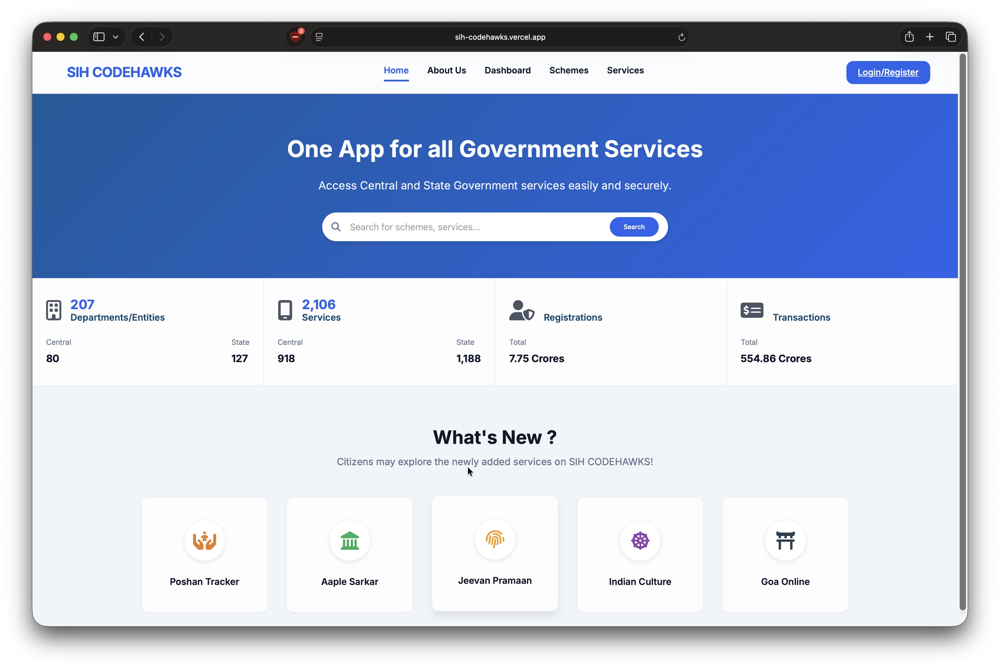

# SIH CODEHAWKS



## Overview

**SIH CODEHAWKS** is a modern, responsive web application designed for comprehensive academic data collection and user profile management. Built on a robust React + Vite architecture, it seamlessly integrates with Google Firebase for secure user authentication and real-time database management.

The platform provides a highly structured dashboard where students or users can register, authenticate, and securely fill out detailed, categorized profile information.

---

## Features

### 🔐 Authentication System (Firebase Auth)

- **Secure Registration & Login:** Create new accounts using an email and password.
- **Dynamic Session Management:** Real-time auth state listener using React Context (`AuthContext`) ensures protected routes are safe.
- **Forgot Password Workflow:** Users can request password reset emails directly to their registered email addresses.
- **In-App Password Management:** Authenticated users can securely change their password from within their dashboard (requires re-authentication).
- **Password Visibility Toggle:** Integrated eye icons to easily toggle password visibility on all password input fields.

### 📋 Interactive Profile Dashboard

A fully responsive, sidebar-navigated dashboard featuring horizontal tab sub-menus for extensive data entry. All data is automatically synced to **Firebase Firestore**.

**Data Collection Categories:**

1. **Personal Details:** First Name, Last Name, Official Email, Category, Caste, Domicile, Nationality, etc.
2. **Contact Details:** Phone Numbers, Permanent vs Local Addresses.
3. **Family Details:** Earning Parent Details, Income, and Career Choices.
4. **Educational & Examination Details:** Previous academic records, institutions, and alumni information.
5. **Bank Details:** Securely collected financial routing info.
6. **Upload Documents:** Interface for uploading necessary identification or academic documents.
7. **Identity & Religion, Physically Handicapped & Minority Status:** Additional specific demographic tabs.

### 🌐 Core Pages & Routing

The app utilizes `react-router-dom` for smooth Single Page Application (SPA) navigation.

- `/` - **Home Page:** Landing page and overview.
- `/about` - **About Us:** Information about the platform.
- `/schemes` - **Schemes:** Details on available academic/government schemes.
- `/services` - **Services:** Platform services and offerings.
- `/login` - **Login / Register Portal:** The gateway to the dashboard.
- `/dashboard/profile` - **Protected User Dashboard:** The core data entry application.

---

## Tech stack

- **Frontend Framework:** [React 19](https://reactjs.org/) (bootstrapped with [Vite](https://vitejs.dev/))
- **Routing:** `react-router-dom`
- **State Management:** React Context API (`AuthContext`) + Hooks (`useState`, `useEffect`)
- **Backend Services:** [Firebase](https://firebase.google.com/)
  - **Firebase Authentication:** Handles user identities, sessions, and password resets.
  - **Firebase Firestore:** A NoSQL cloud database storing user profile structures securely.
- **Icons & UI:** [Lucide React](https://lucide.dev/) & FontAwesome
- **Styling:** Custom Vanilla CSS utilizing Flexbox, CSS Grid, and modern UI/UX design tokens (Glassmorphism, gradients, micro-animations).

---

## Project structure

```text
SIH-CODEHAWKS/
├── api/                    # Vercel-only serverless endpoint
├── functions/              # Firebase Cloud Functions
├── public/                 # Static browser assets
├── src/
│   ├── assets/             # App images
│   ├── components/         # Shared UI and route guards
│   ├── context/            # Authentication state
│   ├── pages/              # Route-level screens
│   │   ├── Dashboard/      # Signed-in user screens
│   │   └── Demo/           # SSO demonstration pages
│   ├── utils/              # File upload and reCAPTCHA helpers
│   ├── firebase.js         # Firebase client setup
│   └── App.jsx             # Route definitions
├── firebase.json           # Firebase Hosting and Function routes
├── firestore.rules         # Firestore security rules
├── .env.example            # Required browser environment variable names
└── package.json            # Commands and frontend dependencies
```

---

## Local development

Follow these steps to run the project locally on your machine.

### Prerequisites

- [Node.js](https://nodejs.org/) (v16 or higher recommended)
- A Google Firebase Account

### 1. Clone the repository

```bash
git clone https://github.com/your-username/SIH-CODEHAWKS.git
cd SIH-CODEHAWKS
```

### 2. Install dependencies

```bash
npm install
```

### 3. Configure Firebase

1. Go to the [Firebase Console](https://console.firebase.google.com/) and create a new project.
2. Navigate to **Build > Authentication** and enable **Email/Password**.
3. Navigate to **Build > Firestore Database** and click **Create Database**. Set your security rules (start in test mode for development).
4. Go to **Project Settings > General**, scroll down, and add a **Web App**.
5. Copy `.env.example` to `.env` and fill in the Firebase web app values.
6. Add your reCAPTCHA v2 **site key** to `VITE_RECAPTCHA_V2_SITE_KEY`.
7. If Firebase App Check is enforced for Authentication, add the separate invisible reCAPTCHA v3
   site key to `VITE_RECAPTCHA_V3_SITE_KEY`.

Never commit `.env`. It is already excluded by `.gitignore`.

### 4. Start the development server

```bash
npm run dev
```

The application will be available at `http://localhost:5173`.

### Everyday commands

```bash
npm run dev          # Start the local app
npm run lint         # Find likely code mistakes
npm run format       # Apply consistent formatting
npm run format:check # Confirm files are formatted
npm run build        # Create a production build
```

---

## Deployment

Firebase Hosting is the primary deployment target. It routes `/api/verify-captcha` to the Firebase Cloud Function in `functions/index.js`.

### Deploying to Firebase

```bash
npm install --prefix functions
npm run build
npx firebase-tools functions:secrets:set RECAPTCHA_V2_SECRET_KEY --project sih-codehawks
npx firebase-tools deploy --only functions:verifyCaptcha,hosting --project sih-codehawks
```

Use the reCAPTCHA v2 **secret key** only when Firebase asks for the function secret. Do not put it in `.env` or a `VITE_` variable.

### Deploying to Vercel:

1. Push your code to GitHub.
2. Log into [Vercel](https://vercel.com/) and click **Add New Project**.
3. Import your GitHub repository.
4. Leave the Framework Preset as `Vite`.
5. Click **Deploy**.

### Firebase production setup

When deploying to a live URL (e.g., `sih-codehawks.vercel.app`), Firebase will block authentication requests for security reasons by default.

**You MUST whitelist your live domain:**

1. Go to the **Firebase Console**.
2. Navigate to **Authentication > Settings > Authorized domains**.
3. Click **Add domain**.
4. Paste your exact deployment URL (e.g., `sih-codehawks.vercel.app` — do not include `https://`).
5. Save. Your production authentication will now work!

---

## 📄 License

This project is open-source and available under the [MIT License](./LICENSE).
